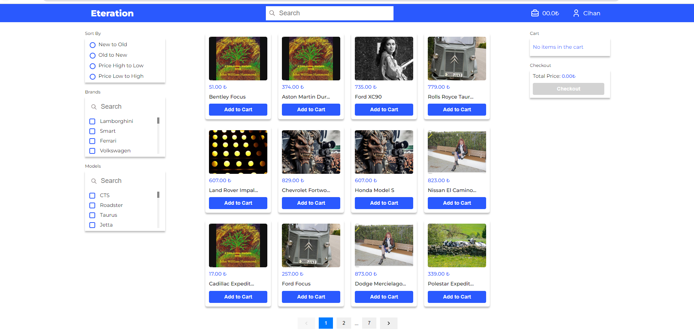
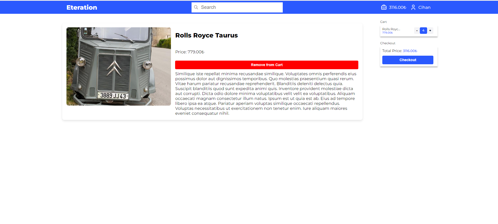
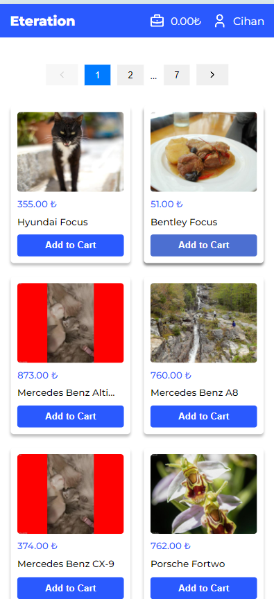
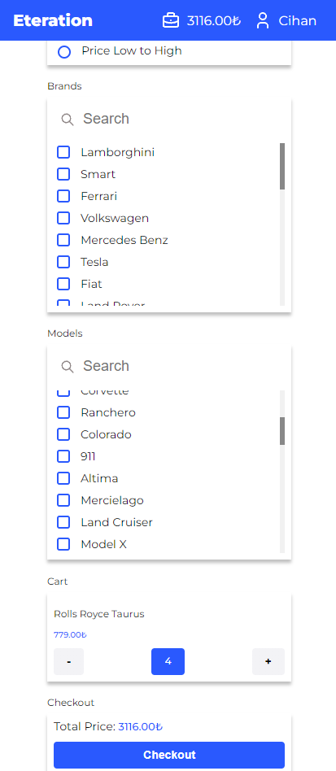

# Eteration Study Case React + Typescript + Vite

This project is a study case for Eteration Interview. It is a simple React application where products are listed and certain operations are performed..

[Site Demo](https://cihanalici.github.io/eteration-study-case/)

## Features

- List products from Eteration API
- Add product to cart
- Remove product from cart
- Calculate total price of products in cart
- Checkout cart
- Clear cart
- Responsive design
- Product detail page
- Product search
- Product filter by category
- Product filter by price
- Product filter by category
- Product sort by name

## Tech Stack

- React
- Typescript
- Vite
- React Router
- Redux Toolkit
- Redux Persist
- Vitest (Jest)
- RTK Query

## Local Development

1. Clone the repository
2. Run `npm install`
3. Create a `.env` file in the root directory and add your API key like so: `VITE_API_URL=your_api_url_here`
4. Run `npm run dev` to start the development server

## Docker Installation

1. Clone the repository
2. Run `docker-compose up --build` to build and start the container

## Unit Testing

Using these libraries, you can run  successfully unit tests. Make sure this libraries are installed in your project.

- Vitest
- @testing-library/jest-dom
- @testing-library/react
- @testing-library/user-event
- jsdom

1. Run `npm run test` to run the unit tests

## Deployment

1. Run `npm run build` to build the project
2. Run `npm run deploy` to deploy the project to GitHub Pages

## Screenshots

